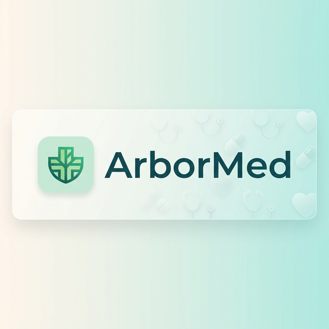
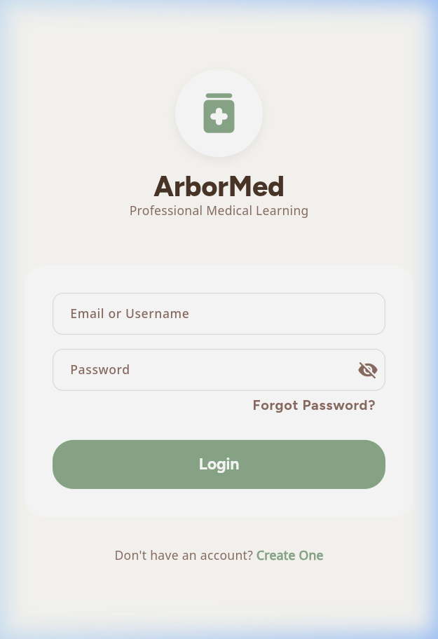
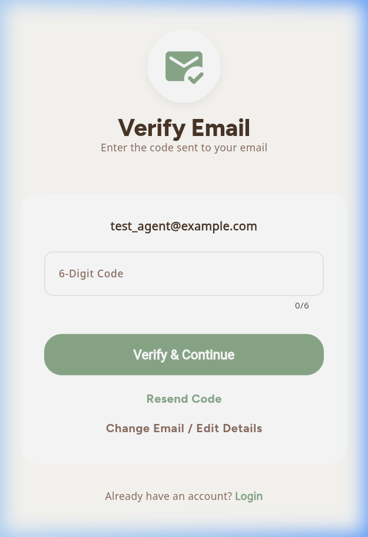
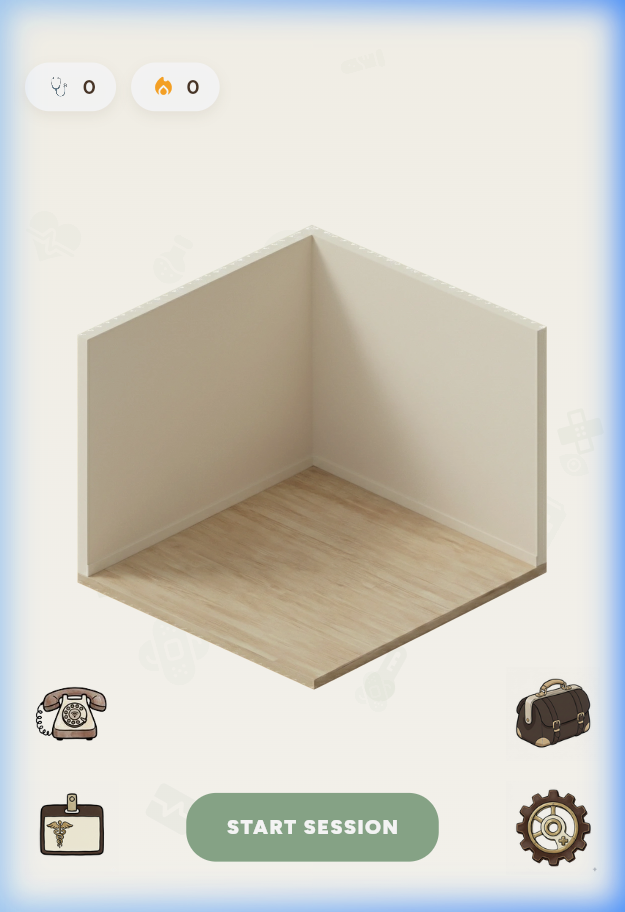
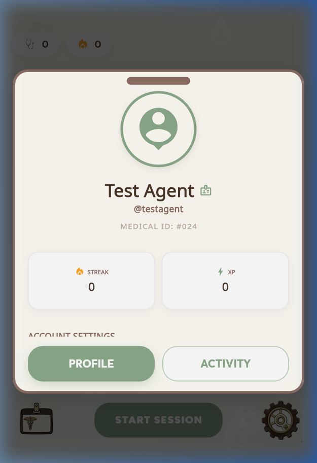
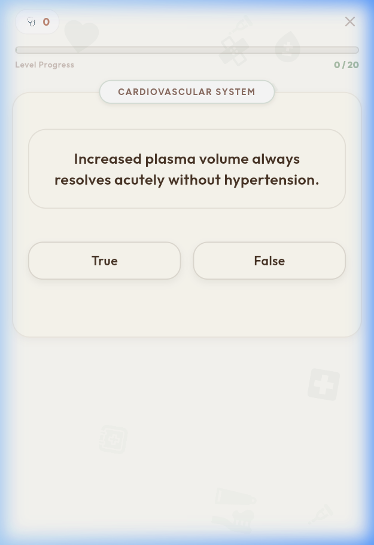
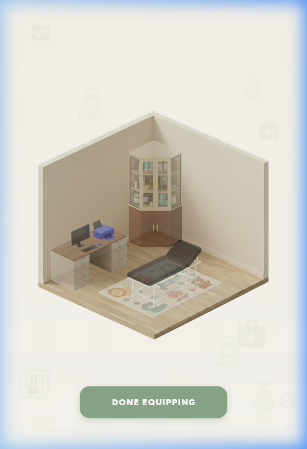
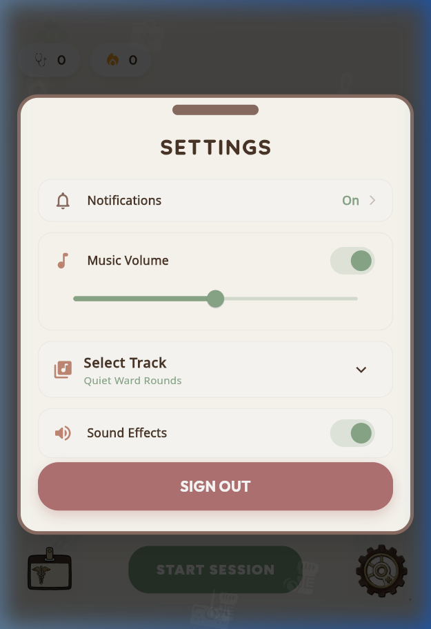

# 🩺 ArborMed: Gamified Medical Education

<div align="center">
  

  # 🌿 ArborMed
  ### *Where Clinical Rigor Meets Cozy Competence*

  [](https://opensource.org/licenses/MIT)
  [](https://flutter.dev)
  [](https://nodejs.org)
  [](https://www.postgresql.org)

  **ArborMed** is a high-fidelity medical education platform that transforms the grueling process of board preparation into a rewarding, atmospheric journey.

  [Explore Docs](docs/) • [Board Logic](apps/student_app/lib/services/adaptive_engine/) • [Study Mode](apps/student_app/lib/screens/study/) • [Duel Arena](services/duel/)
</div>

---

## 🏗️ Core Pillars

ArborMed isn't just a quiz app; it's a "Cozy Competence" ecosystem designed to prevent burnout while maintaining the highest academic standards.

| **Clinical Rigor** | **Cozy Aesthetics** | **Deep Gamification** |
| :--- | :--- | :--- |
| **Adaptive Learning**: Powered by a custom SM-2 algorithm and Bloom's Taxonomy mapping for 100% retention. | **Atmospheric Focus**: Low-stress, isometric virtual environments designed to keep students in the "Flow" state. | **Core Loop**: Study → Earn (XP/Coins) → Customize (Shop/Room) → Compete (Real-time PvP). |

---

## 📸 Visual Journey

### 🚪 First Entry
<div align="center">
  
  
  <p><i>A seamless, professional onboarding experience.</i></p>
</div>

### 🩺 Your Virtual Clinic (Home) & Profile
<div align="center">
  
  
  <p><i>Manage your stats, track your streak, and relax in your customizable clinic.</i></p>
</div>

### 🧠 Adaptive Quiz Session & Activity
<div align="center">
  
  
  <p><i>High-yield questions served exactly when your brain needs them.</i></p>
</div>

### 🛍️ The Medical Shop & Settings
<div align="center">
  
  
  <p><i>Equip your space with medical gear and tune your study environment.</i></p>
</div>

---

## 🧬 Technical Architecture

ArborMed is built with a **Local-First, Cloud-Synced** architecture to ensure zero-latency study sessions.

### 📱 Frontend (The Student App)
- **Framework**: [Flutter](https://flutter.dev) (Cross-platform Android/iOS/Web/Desktop)
- **State Management**: `Provider` + `ChangeNotifier`
- **Local Persistence**: `Drift` (SQLite) for offline reliability
- **UI Logic**: Custom isometric room engine with dynamic layout

### ⚙️ Backend (The Neural Core)
- **Runtime**: [Node.js](https://nodejs.org) + [Express](https://expressjs.com)
- **Database**: [PostgreSQL](https://www.postgresql.org) (Primary) + [Redis](https://redis.io) (Caching)
- **Real-time**: [Socket.IO](https://socket.io) for PvP Duel Mode coordination
- **Language**: English & Hungarian (Full i18n support)

---

## 🚀 Getting Started

### 1. Requirements
- Flutter SDK (Universal)
- Node.js & npm
- PostgreSQL Instance

### 2. Backend Setup
```bash
cd services/backend
npm install
npm run dev
```

### 3. Student App Setup
```bash
cd apps/student_app
flutter pub get
flutter run
```

---

<div align="center">
  <h3>Join the Medical Revolution</h3>
  <p>Built with ❤️ by medical students, for medical students.</p>
</div>
 in a row at the current level) AND are currently below Level 4.
*   **Maintenance**: If you answer incorrectly, your streak resets to 0, requiring you to rebuild consistency before advancing.

### 4. True Mastery Score 📊
We calculate a weighted mastery score to reflect depth of understanding:
*   **Level 1-2 Questions**: 1.0x Weight
*   **Level 3-4 Questions**: 2.0x Weight
*   **Formula**:
    ```
    (Count(L1-2 Mastered) * 1 + Count(L3-4 Mastered) * 2)
    -------------------------------------------------------
    (Count(L1-2 Total) * 1 + Count(L3-4 Total) * 2)
    ```
*   *Result*: A percentage (0-100%) that rewards higher-order thinking more than basic recall.

---

## ⚔️ Duel Mode: Real-Time PvP

Challenge other students in real-time knowledge battles!

*   **Wager System**: Players bet **Stethoscopes (Coins)** to enter a duel.
*   **Matchmaking**: Powered by **Socket.IO**, the server pairs players with similar wagers.
*   **Gameplay**: Both players answer the same set of 3 questions.
*   **Winning**:
    *   The player with the higher score wins the pot (2x the wager).
    *   **Draw**: If scores are tied, both players get their wager back.
    *   **Disconnect**: If an opponent disconnects, you win by default.

---

## 🏥 The Ecosystem

### The Shop & Economy
The **Medical Supply Shop** is where your hard work pays off visually.
*   **Currency**: Stethoscopes (🩺). Scarcity is tuned to make high-tier items feel like genuine achievements.
*   **Inventory**: Medical equipment, cozy decor, and upgrades.
*   **The Room**: Your personal space that evolves with your knowledge.

### Localization & Inclusivity 🌍
*   **Bilingual Core**: Fully localized for **Hungarian (Magyar)** and **English**. Toggle instantly in settings.
*   **Accessibility**: High-contrast text options and screen-reader friendly structure.

---

## 🏗️ Technical Architecture

ArborMed uses a modern **Local-First Architecture** to ensure zero-latency learning and offline capability.

### **Frontend (Mobile & Web)**
*   **Framework**: [Flutter](https://flutter.dev/) (3.x).
*   **Local Database**: [Drift](https://drift.simonbinder.eu/) (SQLite) for robust offline storage.
*   **State Management**: `Provider` architecture.
*   **Sync**: Background synchronization engine to keep local progress in sync with the server.

### **Backend API**
*   **Runtime**: Node.js + Express.
*   **Real-time**: [Socket.IO](https://socket.io/) for Duel Mode.
*   **Database**: PostgreSQL (Hosted on Supabase).
*   **Services**:
    *   `adaptiveEngine.js`: The brain of the quiz logic.
    *   `analyticsEngine.js`: SM-2 algorithm and math.
    *   `socketService.js`: Manages real-time duel lobbies and game state.

---


## 📖 Codebase Documentation

The ArborMed codebase is heavily documented to aid in onboarding and maintainability.

*   **Backend (Node.js)**: Core services (like `adaptiveEngine.js` and `analyticsEngine.js`) and utility functions use **JSDoc** comments. This provides strict parameter definitions and return type hints for complex algorithms.
*   **Frontend (Flutter)**: The Dart codebase utilizes standard **Dartdoc** (`///`) comments. Key architecture components such as `ApiService`, state providers (`AuthProvider`), and routing endpoints are fully documented to explain their lifecycle and integration points.

## 🛠️ Developer Tools

The repository includes a suite of Python-based CLI tools to streamline content creation (`/tools`):

*   **`python tools/generate_voxel_hitboxes.py`**: Analyzes transparency to create interactive surface areas for the isometric room.
*   **`tools/hard_alpha_clip.py`**: Specialized image processor for medical assets.
*   **`tools/analyze_hitboxes.py`**: Debugging tool for room interactivity.

---

## 🚀 Getting Started

### Prerequisites
*   Flutter SDK (3.x+)
*   Node.js (18+)
*   PostgreSQL

### Installation
1.  **Clone the Repo**:
    ```bash
    git clone https://github.com/shubailo/arbor-med.git
    ```
2.  **Backend Setup**:
    ```bash
    cd services/backend
    npm install
    # Create .env file with DATABASE_URL, JWT_SECRET, etc.
    npm run dev
    ```
3.  **Mobile Setup**:
    ```bash
    cd apps/student_app
    flutter pub get
    # Run on Mobile
    flutter run

    # Run on Web
    flutter run -d chrome
    ```

---

*Built with ❤️ for Medical Students.*
