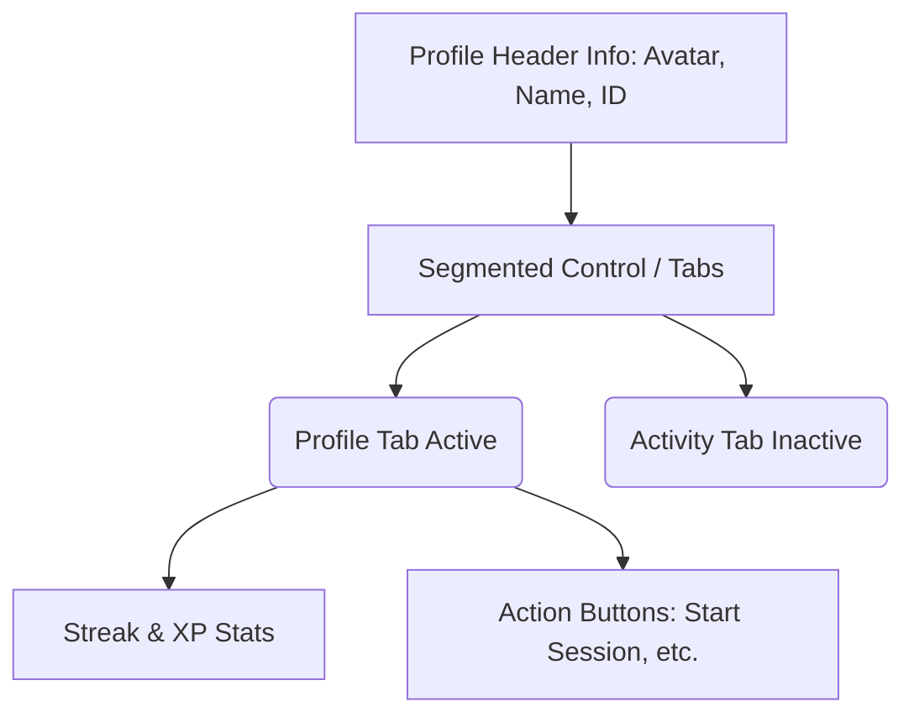

# Wireframe Descriptions & Mockups

## Profile Modal - Tab Redesign
The current Profile modal uses pill-shaped buttons for tabs, which can look like actions instead of navigation. We recommend a segmented control or connected tab design.



### Text Mockup:
```text
+---------------------------------------+
|             [ Avatar ]                |
|           Test Agent                  |
|          @testagent                   |
|                                       |
|  [    PROFILE    |    Activity   ]    |
|  +---------------------------------+  |
|  |  🔥 Streak: 0      ⚡ XP: 0    |  |
|  +---------------------------------+  |
+---------------------------------------+
```

## Settings Screen - Destructive Action
The "Delete Account" button needs visual demotion to prevent accidental clicks.

### Text Mockup:
```text
+---------------------------------------+
|                SETTINGS               |
|                                       |
|  [Toggle] Sound Effects               |
|  [Toggle] Haptic Feedback             |
|                                       |
|  [        LOG OUT (Primary)       ]   |
|                                       |
|  -----------------------------------  |
|        [ Delete Account (Text) ]      |
+---------------------------------------+
```
