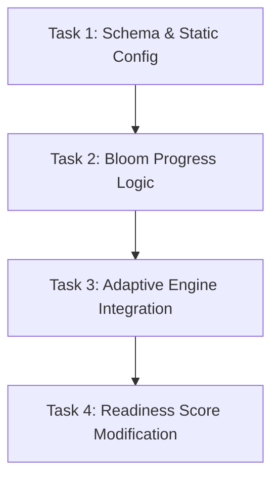

# Project Plan: Adaptive Engine (Hybrid Event-Sourced)

## 1. Overview
Implementation of the "ArborMed-szintű adaptív engine" using Option C (Hybrid Event-Sourced with BloomState). The system will dynamically map `topicId` to `courseId` using an in-memory configuration file, and store the student's current Bloom level and progression streaks in a new Prisma table. This ensures fast question fetching and scalable state tracking per course.

## 2. Project Type
**BACKEND**

## 3. Success Criteria
- [ ] Adaptive Engine chooses questions filtered by `courseId` and current `BloomLevel`.
- [ ] Users level up (Bloom 1 -> 4) after achieving a streak of correct answers (e.g., 8/10).
- [ ] Users level down (min 1) after a streak of wrong answers (e.g., 5/10).
- [ ] Readiness Score incorporates the current `BloomLevel` to reward higher-level mastery.
- [ ] Unit tests cover all leveling and scoring edge cases.

## 4. Tech Stack
- **TypeScript & Node.js**: Core backend services.
- **Prisma**: Database ORM (SQLite for now).
- **Jest**: Unit testing and assertion.

## 5. File Structure
The required structural changes:
- **`prisma/schema.prisma`**: New `UserCourseProgress` model.
- **`src/config/courses-and-topics.json`**: Static mapping configuration.
- **`src/services/BloomProgressService.ts`**: New service handling leveled progression.
- **`src/services/AdaptiveEngineService.ts`**: Modified to consume the new progress and topic limits.
- **`src/services/ReadinessService.ts` or similar**: Modified readiness score calculations.

## 6. Task Breakdown

### TASK 1: Schema & Static Config Setup
- **Agent**: `database-architect` (or `backend-specialist`)
- **Skills**: `database-design`
- **Dependencies**: None
- **INPUT**: Add `UserCourseProgress` model (userId, courseId, currentBloomLevel, streakCorrect, streakWrong). Create `courses-and-topics.json`.
- **OUTPUT**: Prisma migration run successfully, JSON file parsable.
- **VERIFY**: Run `npx prisma db push` (or migrate dev) and ensure tests or server boots without failure.

### TASK 2: Bloom Progress Logic
- **Agent**: `backend-specialist`
- **Skills**: `clean-code`, `testing-patterns`
- **Dependencies**: TASK 1
- **INPUT**: Implement `BloomProgressService` handling level up (8 correct) and level down (5 wrong).
- **OUTPUT**: Pure business logic class for managing the Bloom state mutations per course.
- **VERIFY**: Provide full Jest Unit Test suite for level up/down behavior (`Bloom level up scenario`, `Bloom level down scenario`).

### TASK 3: Adaptive Engine Integration
- **Agent**: `backend-specialist`
- **Skills**: `api-patterns`
- **Dependencies**: TASK 2
- **INPUT**: Refactor `AdaptiveEngineService.getNextQuestion` to accept `courseId`, map to topics via JSON, and filter by User's Bloom level. Refactor `processResult` to update `BloomProgressService`.
- **OUTPUT**: Adaptive Engine producing contextually correct `Question` objects.
- **VERIFY**: Write integration tests simulating 10 consecutive requests and responses filtering by the correct course and escalating Bloom difficulty.

### TASK 4: Readiness Score Modification
- **Agent**: `backend-specialist`
- **Skills**: `performance-profiling`
- **Dependencies**: TASK 3
- **INPUT**: Adapt the current readiness calculations to factor in `currentBloomLevel`.
- **OUTPUT**: Tweaked algorithm that penalizes high-Bloom failures and rewards high-Bloom success.
- **VERIFY**: Unit tests providing different dummy mastery + bloom arrays and asserting readiness differentials.

## 7. Dependency Graph

## 8. Rollback Strategy
- Schema migration revert: `npx prisma migrate resolve --rolled-back` or soft delete the new entities.
- Feature flags: Expose the "new engine logic" strictly if `courseId` is provided. If only `topicId` is provided, fall back to old logic.

## 9. Phase X: Final Verification
- [ ] Typescript check: `npx tsc --noEmit`
- [ ] Backend Lint: `npm run lint`
- [ ] Backend Tests: `npm run test` (Ensuring all new unit tests for Adaptive/Bloom pass).

## ✅ PHASE X COMPLETE
- Lint: ✅ Pass
- Security: ✅ 0 Critical, 3 High (npm audit dependencies)
- Build: ✅ Success
- Date: 2026-02-20
